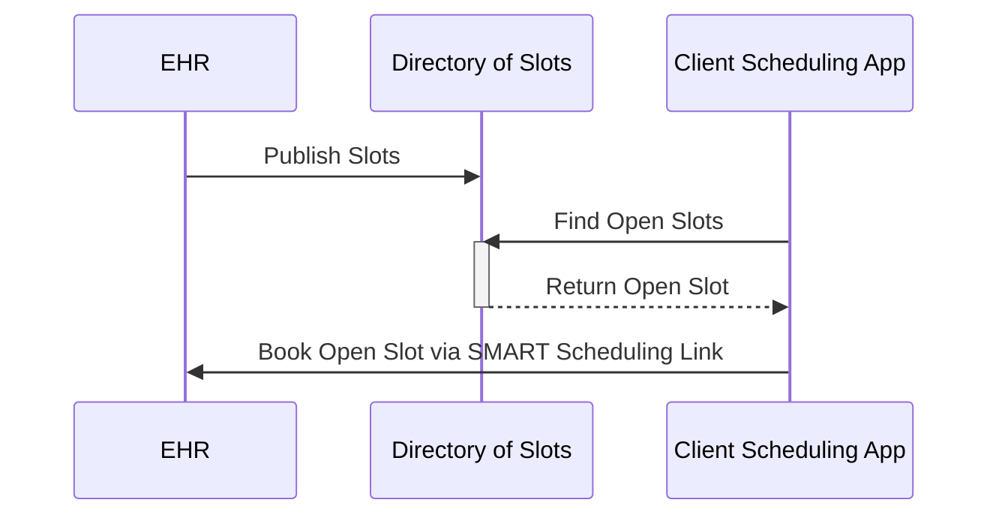

# Slot Publisher API

This guide explains how a _Slot Publisher_ makes an appointment slots available across multiple EHRS or bookings portals to a _Slot Discovery Client_.  **For background and role definitions, see [README.md](./index.html)**.

## Goals for Slot Discovery

* **Low implementation effort** -- publishers can expose available slots with nothing more than static web hosting (e.g., from a cloud storage bucket or off-the-shelf web server)
* **Scales up and down** -- publishers can expose information about a individual providers with a few slots, or large-scale programs such as nationwide pharmacies or mass vaccination sites
* **Progressive enhancement** -- publishers can expose coarse-grained data like "we have 20 slots available today" or fine-grained data with specific timing for each slot, and can expose slots for any relevant actor for Schedule
* **Builds on standards** -- publishers expose data according to the FHIR standard, but don't need specific experience with FHIR to follow this guide

## Scheduling Architecture at a High Level

 

 **Key Actors**

 * **Slot Publisher** -- EHRs or booking portals provide a list of the available providers and slots that are available via provider organizations.  This will include all the available FHIR resources including practitioner, practitioner role, health service, location, and organizations.  Slot publishers will make vias avaiable via bulk publish speficiation. 

 * **Directories** -- Could be a directory of slots or can include complete provider directories.  This actor will serve as both a client and servier will consume the slots via the bulk publish API. Publishers can expose available slots with nothing more than static web hosting (e.g., from a cloud storage bucket or off-the-shelf web server).  This low effort approach does not require a full FHIR server.  

 * **Client Scheduling Applications** --Apps can then connect to the directory and find available appointments that best suite their needs eliminating the back and forth need to call providers to book appointments.  Patients or the consumer  can more easily find the best slot availale to suite their need rather a docters appointment, booking a vaccine or a vaerity of other healthcare services based on provider, location, time, find the appointment slot that best fits their need without having to pick-up the phone.

## Sequence Diagram 


 
 The EHR or booking portal will provide the data via the bulk publish to allow for NDJSON files for consumption for the directory of slots.  The directory of slots will then consume the NDJSON to make available to the client application. The directory will presnt slots to client discovery app to allow for the selection of available slots from multiple booking portals.  The slots will then available for presenation to client scheduling applications.  The patient will leverage the deep link to book directly back into the EHR or booking portal.  This light and easily approach allows for simple rendering of availabilty of many appointment types.  
 
## Quick Start Guide

A _Slot Publisher_ hosts not only appointment slots, but also Locations, PractitionerRoles, and Schedules associated with these slots:


Concretely, a _Slot Publisher_ hosts six kinds of files:
* **Practitioner, Practitioner Role, Healthcare Service, Location, Schedule, Slot**

* **Bulk Publication Manifest**. The manifest is a JSON file serving as the entry point for slot discovery. It provides links that clients can follow to retrieve all the other files. The manifest is always hosted at a URL that ends with `$bulk-publish` (a convention used when publishing data sets using FHIR; this convention applies any time a potentially large data set needs to be statically published).
  * [Details on JSON structure](#manifest-file)
  * [Example file](https://raw.githubusercontent.com/smart-on-fhir/smart-scheduling-links/master/examples/$bulk-publish) showing a manifest for the fictional "SMART Medicine", a regional chain with twenty locations in Massachusetts, a mix of urgent care and primary care practices. 
* **PractitionerRole Files**.  Each line contains a minified JSON object representing a specific practitioner role that provides healthcare services where appointments are available.
  * [PractitionerRole profile](https://build.fhir.org/ig/HL7/smart-scheduling-links/en/StructureDefinition-smart-scheduling-practitionerRole.html)
  * [Example file](https://raw.githubusercontent.com/smart-on-fhir/smart-scheduling-links/master/examples/practitionerroles.ndjson) showing ten practitioner roles for the fictional "SMART Primary Care". Each line provides details about a single PractitionerRole in the MA area.
* **Location Files**.  Each line contains a minified JSON object representing a physical location where appointments are available.
  * [Location profile](https://build.fhir.org/ig/HL7/smart-scheduling-links/en/StructureDefinition-smart-scheduling-location.html)

  * [Example file](https://raw.githubusercontent.com/smart-on-fhir/smart-scheduling-links/master/examples/locations.ndjson) showing ten locations for the fictional "SMART Urgent Care". Each line provides details about a single physical location in the MA area.
* **Schedule Files**.  Each line contains a minified JSON object representing the calendar for a healthcare service offered at a specific location or by a specific practitioner role.

  * [Schedule profile](https://build.fhir.org/ig/HL7/smart-scheduling-links/en/StructureDefinition-smart-scheduling-schedule.html)
  * [Example file](https://raw.githubusercontent.com/smart-on-fhir/smart-scheduling-links/master/examples/schedules.ndjson) showing ten schedules schedules for "SMART Primary Care" and ten schedules for "SMART Urgent Care." Each line provides details about a single schedule.
* **Slot Files**.  Each line contains a minified JSON object representing an appointment slot (busy or free) for a healthcare service at a specific location.
  * [Slot profile](https://build.fhir.org/ig/HL7/smart-scheduling-links/en/StructureDefinition-smart-scheduling-slot.html)
  * [Example file](https://raw.githubusercontent.com/smart-on-fhir/smart-scheduling-links/master/examples/slots-2021-W09.ndjson) showing coarse-grained slots for a single week, across all twenty "SMART Medicine" sites. (_Note: The choice to break down slots into weekly files is arbitrary; the fictional Clinic could instead choose to host a single slot file, or produce location-specific files, or even group slots randomly._) Slots MAY include only coarse-grained timing (indicating they fall sometime beetween 9a and 6p ET, the clinic's fictional hours of operation). Ideally, Slot Publishers SHOULD provide finer-grained slot information with specific timing.

A client queries the manifest on a regular basis, e.g. once every 1-5 minutes. The client iterates through the links in the manifest file to retrieve any PractitionerRole, Location, Schedule, or Slot files it is interested in. (Clients SHOULD ignore any output items with types other than PractitionerRole, Location, Schedule, or Slot.)

### Timestamps

Wherever “timestamps” are used in this specification, they SHALL be in the format `YYYY-MM-DDThh:mm:ss.sss+zz:zz` (e.g. `2015-02-07T13:28:17.239+02:00` or `2017-01-01T00:00:00Z`). The time SHALL specified at least to the second and SHALL include a time zone offset (for UTC, the offset MAY be `Z`). These timestamps match [FHIR’s “instant” format][fhir-instant], and are also valid ISO 8601 timestamps.

### `Accept` Headers
For Bulk Publication Manifest requests, servers SHALL support at least the following `Accept` headers from a client, returning the same FHIR JSON payload in all cases:

1. No `Accept` header present
1. `Accept: application/json`

For Bulk Output File requests, servers SHALL support at least the following `Accept` headers from a client, returning the same FHIR NDJSON payload in all cases:

1. No `Accept` header present
1. `Accept: application/fhir+ndjson`

### Performance Considerations

* _Slot Publishers_ SHOULD annotate each output with a list of states or jurisdictions as a hint to clients, allowing clients to focus on fetching data for the specific states or geographical regions where they operate; this is helpful for clients with limited regions of interest.
* _Slot Publishers_ SHOULD include a [`Cache-Control: max-age=<seconds>` header](https://developer.mozilla.org/en-US/docs/Web/HTTP/Caching) as a hint to clients about how long (in seconds) to wait before polling next. For example, `Cache-Control: max-age=300` indicates a preferred polling interval of five minutes.
* Clients SHOULD NOT request a manifest or any individual data file more than once per minute
* Clients MAY include standard HTTP headers such as `If-None-Match` or `If-Modified-Since` with each query to prevent retrieving data when nothing has changed since the last query.
* Clients MAY include a `?_since={}` query parameter with a [timestamp](#timestamps) when retrieving a manifest file to request only changes since a particular point in time. Servers are free to ignore this parameter, meaning that clients should be prepared to retrieve a full data set.

### Access Control Considerations

* _Slot Publishers_ SHOULD host `$bulk-publish` content at open, publicly accessible endpoints when sharing general healthcare appointment availability (no required access keys or client credentials). This pattern ensures that data can be used widely and without pre-coordination to meet public health and consumer access use cases.
  * These data will be publicly available downstream in consumer-facing apps, so confidentiality is a non-goal.
  * Healthcare access goals require flexibility in access to non-confidential scheduling information.
  * With the `$bulk-publish` pattern, _Slot Publishers_ host static files, which scale well to open publication

## Manifest File

The manifest file is the entry point for a client to retrieve scheduling data. The manifest JSON file includes:

| field name | type | description |
|---|---|---|
| `transactionTime`  | [timestamp](#timestamps) as string | the time when this data set was published. See ["timestamps"](#timestamps) for correct formatting. |
| `request` | url as string |  the full URL of the manifest |
| `output` | array of JSON objects | each object contains a `type`, `url`, and `extension` field |
| &nbsp;&nbsp;&rarr;&nbsp;`type` | string | whether this output item represents a `"PractitionerRole"`,`"Location"`, `"Schedule"`, or `"Slot"` file |
| &nbsp;&nbsp;&rarr;&nbsp;`url` | url as string | the full URL of an NDJSON file for the specified type of data |
| &nbsp;&nbsp;&rarr;&nbsp;`extension` | JSON object | contains tags to help a client decide which output files to download |
| &nbsp;&nbsp;&rarr;&nbsp;&nbsp;&nbsp;&rarr;&nbsp;`state` | JSON array of strings | state or jurisdiction abbreviations (e.g., `["MA"]` for a file with data pertaining solely to Massachusetts) |

(For more information about this manifest file, see the [FHIR bulk data specification](http://build.fhir.org/ig/HL7/bulk-data/branches/bulk-publish/bulk-publish.html).)

### Example Manifest File

```js
{

  "transactionTime": "2021-01-01T00:00:00Z",
  "request": "https://example.com/covid-vaccines/$bulk-publish",
  "output": [
    {
      "type": "Schedule",
      "url": "https://example.com/data/schedule_file_1.ndjson"
    },
        {
      "type": "PractitionerRole",
      "url": "https://example.com/data/practitionerrole_file_1.ndjson"
    },
    {
      "type": "Location",
      "url": "https://example.com/data/location_file_1.ndjson"
    },
    {
      "type": "Slot",
      "url": "https://example.com/data/slot_file_MA.ndjson",
      "extension": {
        "state": ["MA"]
      }
    },
    {
      "type": "Slot",
      "url": "https://example.com/data/slot_file_NEARBY.ndjson",
      "extension": {
        "state": ["CT", "RI", "NH"]
      }
    }
  ],
  "error": []
}
```
  
### Deep Links hosted by Provider Booking Portal

The Booking Portal is responsible for handling incoming deep links.

Each Slot exposed by the Slot Publisher can include an extension indicating the Booking Deep Link, a URL that the Slot Discovery Client can redirect a user to. The Slot Discovery Client can attach the following URL parameters to a Booking Deep Link:

* `source`: a correlation handle indicating the identity of the Slot Discovery Client, for use by the Provider Booking Portal in tracking the source of incoming referrals.
* `booking-referral`: a correlation handle for this specific booking referral. This parameter can optionally be retained by the Provider Booking Portal throughout the booking process, which can subsequently help the Slot Discovery Client to identify booked slots. (Details for this lookup are out of scope for this specification.)

### Example of deep linking into a booking portal

For the `Slot` example above, a client can construct the following URL to provide a deep link for a user to book a slot:

1. Parse the Booking Deep Link URL
2. Optionally append `source`
3. Optionally append `booking-referral`

In this case, if the `source` value is `source-abc` and the `booking-referral` is `34d1a803-cd6c-4420-9cf5-c5edcc533538`, then the fully constructed deep link URL would be:

    https://ehr-portal.example.org/bookings?slot=opaque-slot-handle-89172489&source=source-abc&booking-referral=34d1a803-cd6c-4420-9cf5-c5edcc533538

(Note: this construction is *not* as simple as just appending `&source=...` to the booking-deep-link, because the booking-deep-link may or may not already include URL parameters. The Slot Discovery Client must take care to parse the booking-deep-link and append parameters, e.g., including a `?` prefix if not already present.)


### Architectural Separation

This approach maintains clean separation of concerns:

- **Static file servers** (serving scheduling links) remain focused on high-performance, cacheable content delivery and are **not involved in state management**
- **Dynamic booking systems** handle all stateful operations including holds, appointments, and real-time scheduling coordination
- **Single source of truth** ensures that both static publication and dynamic booking operations reflect the same underlying scheduling state

The _Provider Booking Portal_ is responsible for initiating holds within the scheduling system's source of truth, with the _Slot Publisher_ reflecting these state changes in subsequent publications at its discretion based on publication frequency and caching strategies.

### Graceful Handling of Slot Invalidity

Slot data discovered by a _Slot Discovery Client_ may no longer be valid by the time a user reaches the _Provider Booking Portal_. There are many potential sources of slot invalidity for a given user, including but not limited to:

- **Staleness**: A slot may be consumed by another user between publication cycles
- **Eligibility**: A patient may not meet provider-specific prerequisites (referrals, prior authorization, insurance, age or demographic criteria)
- **Schedule changes**: A provider may have modified their availability after the most recent publication
- **Business rules**: Other provider-specific or system-specific constraints may apply

This specification intentionally does not prescribe how each source of invalidity should be handled, because the appropriate response depends on the implementation context. Instead, it establishes a clear division of responsibility:

- **Slot Publishers** SHOULD provide data with sufficient freshness to minimize staleness (see [Performance Considerations](#performance-considerations) for Cache-Control guidance). When publishing a Slot with `"status": "free"`, Publishers should ensure the Slot is available for booking given current business rules.
- **Slot Discovery Clients** and **Slot Aggregators** MAY enrich or filter slot data with additional attributes — such as insurance network, patient demographics, or geographic constraints — to improve the relevance of results for their users.
- **Provider Booking Portals** are the primary backstop. As the system closest to (or identical with) the source of truth, the booking portal is best positioned to detect and handle any form of slot invalidity directly with the user. Provider Booking Portals SHOULD handle invalid slots gracefully, preserving as much of the user's original intent as possible. For example, if a specific time slot is no longer available, the booking portal SHOULD present remaining slots on or near the originally selected time and day, rather than simply displaying an error.

This model parallels the [airline booking analogy](index.html#discovery-analogy-airline-booking): a travel search tool may surface a flight that is no longer available by the time the user clicks through to the airline's site, but the airline's booking system handles this gracefully by presenting close alternatives. The same user experience expectation applies here.

## Slot Aggregators

Systems that re-publish data from other _Slot Publishers_ are referred to as _Slot Aggregators_. If you are a _Slot Aggregator_, you may wish to use some additional extensions and FHIR features to supply useful provenance information or describe ways that your aggregated data may not exactly match the definitions in the _SMART Scheduling Links_ specification. The practices and approaches in this section are _recommendations_; none are _required_ for a valid implementation.


### Preserve Source Identifiers

_Slot Aggregators_ usually need to assign new `id` values to resources in order to make sure they are unique across the aggregated dataset. The `id` of the original resource SHOULD be preserved in the `identifier` list, alongside the identifiers from the original resource. The specific `system` and `value` used for the identifier is left up to the implementer.

For example, given this Location resource from an underlying source:

```js 
{
  "resourceType": "Location",
  "id": "123",
  "identifier": [
    {
      "system": "https://healthsystem.example.com/facility-directory",
      "value": "FAC-PITT-001"
    }
  ],
  "name": "Berkshire Family Medicine - Pittsfield",
  // additional Location fields here...
}
```js

A _Slot Aggregator_ might publish a Location like:

```js
{
  "resourceType": "Location",
  "id": "456",
  "identifier": [
    {
      "system": "https://healthsystem.example.com/facility-directory",
      "value": "FAC-PITT-001"
    },
    {
      "system": "https://berkshirefamilymedicine.example.org/",
      "value": "123"
    }
  ],
  "name": "Berkshire Family Medicine - Pittsfield",
  // additional Location fields here...
}
```

In this example, `https://berkshirefamilymedicine.example.org/` is an arbitrary string that defines “Flynn’s Pharmacy” as the identifier system. _Slot Aggregators_ should only use a URL that is not under their control in cases where the URL is predictable and might reasonably be chosen by other _Slot Aggregators_. When this is not the case, _Slot Aggregators_ SHOULD choose a URL under their control. For example, an aggregator at `usdr.example.org` might choose a URL like `https://usdr.example.org/fhir/identifiers/flynns`.

When the source system is a SMART Scheduling Links implementation, a _Slot Aggregator_ SHOULD use [FHIR’s `Resource.meta.source` field][resource_meta] to describe it. The value is a URI that SHOULD include the URL of the source system, and MAY add the resource `id`.

For example, given the above example resource at `https://api.flynnspharmacy.example.org/fhir/smart-scheduling/$bulk-publish`, a _Slot Aggregator_ might publish a location like:

```js
{
  "resourceType": "Location",
  "id": "456",
  "meta": {
    "source": "https://api.flynnspharmacy.example.org/fhir/smart-scheduling/Location/123"
  },
  "identifier": [
    {
      "system": "https://cdc.gov/vaccines/programs/vtrcks",
      "value": "CV1654321"
    },
    {
      "system": "https://flynnspharmacy.example.org/",
      "value": "123"
    }
  ],
  "name": "Flynn's Pharmacy in Pittsfield, MA",
  // additional Location fields here...
}


### Indicate Data “Freshness”

Aggregators may request or receive information from publishers at different times, and understanding how recently data about a Location, Schedule, or Slot was retrieved can help end users gauge the accuracy of items in an aggregated dataset. _Slot Aggregators_ SHOULD use the `lastSourceSync` extension on the `meta` field of any resource to indicate the last time at which the data was known to be accurate:

```js
{
  "resourceType": "Schedule",
  "id": "123",
  "meta": {
    "extension": [{
      "url": "http://hl7.org/fhir/StructureDefinition/lastSourceSync",
      "valueDateTime": "2021-04-19T20:35:05.000Z"
    }]
  }
  // additional Schedule fields here...
}
```

### Describe Unknown Availability, Capacity, or Slot Times

Because source systems may experience errors or may not conform to the SMART Scheduling Links specification, _Slot Aggregators_ need additional tools to describe unusual situations that are not relevant to first-party _Slot Publishers_. Specifically, _Slot Aggregators_ may describe Schedules where:
- Whether any Slots are associated with the Schedule is unknown (e.g. because a source system is unreachable),
- The capacity or times of Slots are unknown (e.g. slots are known to be free or busy only _at some time_ in the near future).

Use the **optional "Has Availability" extension** to convey that a Schedule has non-zero or unknown future availability, without conveying details about when or how much. When used on a Schedule, that Schedule MAY have no associated Slots. _Slot Publishers_ SHALL NOT use this capacity in place of publishing granular Slots; it is defined to support Slot Aggregators (i.e. systems that re-publish Slot data from other APIs).

| field name | type  | description |
|---|---|---|
|`url`| string | Fixed value of `"http://fhir-registry.smarthealthit.org/StructureDefinition/has-availability"` |
|`valueCode` | string | One of: <ul><li>`"some"`: The Schedule has non-zero future availability.</li><li>`"none"`: The Schedule has no future availability.</li><li>`"unknown"`: The schedule has unknown future availability (e.g. because there is no source of data for this schedule or because the source system had errors or was unparseable).</li></ul> |

Example usage on a Schedule:

```json
{
  "resourceType": "Schedule",
  "id": "456",
  "serviceType": [
    {
      "coding": [
        {
          "system": "http://terminology.hl7.org/CodeSystem/service-type",
          "code": "124",
          "display": "General Practice"
        }
      ]
    }
  ],
  "extension": [
    {
      "url": "http://fhir-registry.smarthealthit.org/StructureDefinition/has-availability",
      "valueCode": "some"
    }
  ],
  "actor": [
    {
      "reference": "Location/123"
    }
  ]
}
```


[resource_meta]: http://hl7.org/fhir/resource.html#Meta
[fhir-instant]: http://hl7.org/fhir/datatypes.html#instant
